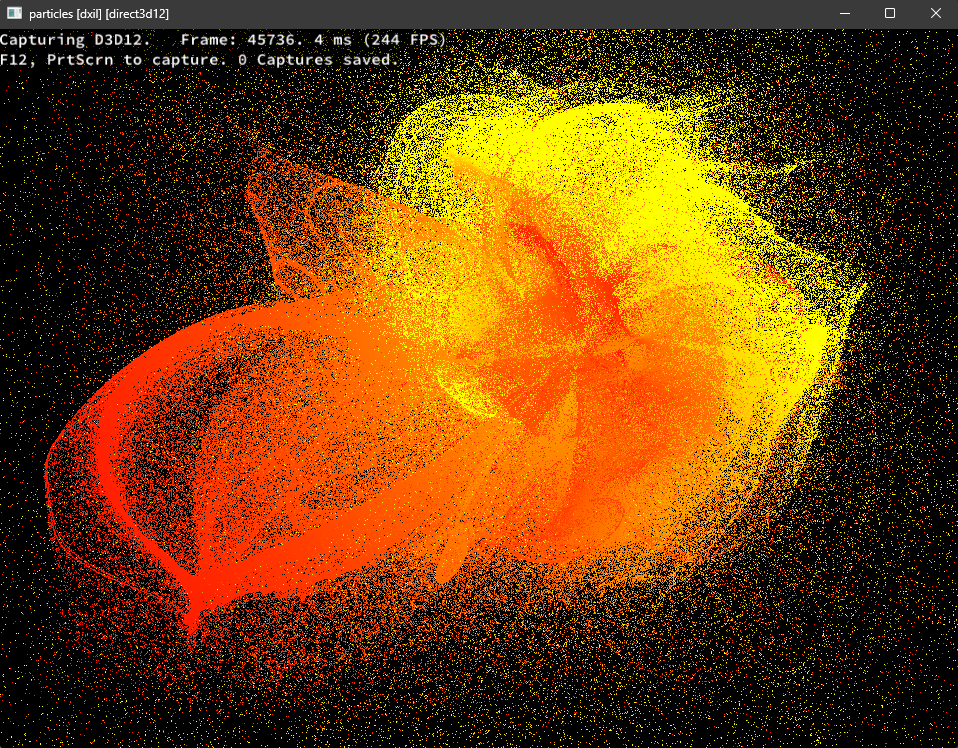
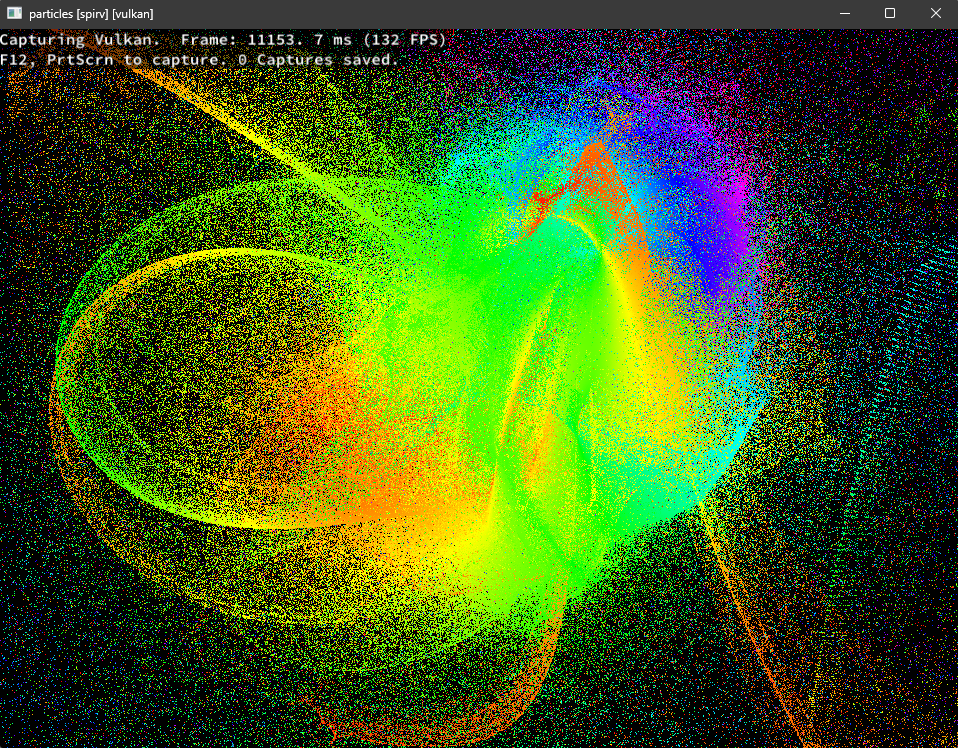

# Particles




Testing out [SDL_shadercross](https://github.com/libsdl-org/SDL_shadercross) on some GPU accelerated particles

### Building

#### Windows

Install the [Vulkan SDK](https://www.lunarg.com/vulkan-sdk/) for glslc

```bash
git clone https://github.com/jsoulier/particles --recurse-submodules
cd particles
mkdir build
cd build
cmake ..
cmake --build . --parallel 8 --config Release
cd bin
./particles.exe
```

#### Linux

```bash
sudo apt install glslc
```

```bash
git clone https://github.com/jsoulier/particles --recurse-submodules
cd particles
mkdir build
cd build
cmake .. -DCMAKE_BUILD_TYPE=Release
cmake --build . --parallel 8
cd bin
./particles
```

#### MacOS

I have no idea, but it should work!

#### Controls

- `Space` to change shader backends
- `LClick` to push particles
- `RClick` to pull particles